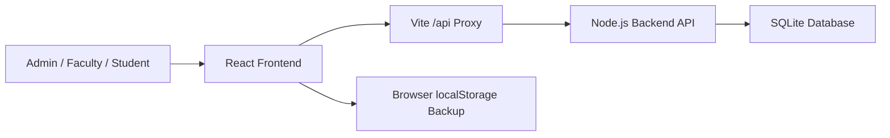

# Architecture

CampusOps AI is a local full-stack prototype for college operations.

## Frontend

- Vite + React + TypeScript
- Role-aware UI for Admin, Faculty, and Student
- Lazy-loaded heavier modules so students do not download admin-only screens
- Responsive dashboard layout for presentation and daily operations
- Browser backup mode for demo safety

## Backend

- Node.js built-in HTTP server
- Node `node:sqlite` database driver
- No paid API and no external database service required
- SQLite file stored at `backend/data/campusops.sqlite`

## Persisted In Backend

- Classes, students, teachers, academic subjects, and timetable slots
- Attendance records
- Period-wise leave requests and approval status
- Departments master data
- Subjects master data
- Audit events

## Local-First Fallbacks

Some existing modules still use browser persistence so the app remains reliable during a presentation:

- Circulars
- Staff register

These can be moved to the backend module by module without changing the overall architecture.

## Production Upgrade Path

For a college adoption pilot:

1. Replace demo login with real authentication.
2. Move all academic, circular, and staff records to backend tables.
3. Add user and role tables with permission checks in the backend.
4. Replace SQLite with PostgreSQL if multi-user deployment is needed.
5. Add backups, logs, and deployment monitoring.

The current structure already separates UI, API, data persistence, and documentation, so this upgrade path is straightforward.
