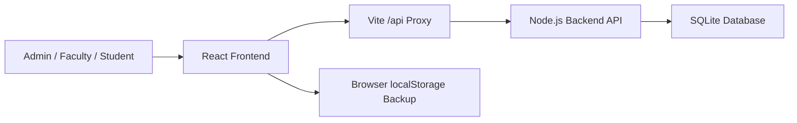

# Architecture

CampusOps AI is a local full-stack prototype for college operations.

## Frontend

- Vite + React + TypeScript
- Role-aware UI for Admin, Faculty, and Student
- Lazy-loaded heavier modules so students do not download admin-only screens
- Responsive dashboard layout for presentation and daily operations
- Browser backup mode for demo safety

## Backend

- Node.js built-in HTTP server
- Node `node:sqlite` database driver
- No paid API and no external database service required
- SQLite file stored at `backend/data/campusops.sqlite`

## Persisted In Backend

- Classes, students, teachers, academic subjects, and timetable slots
- Attendance records
- Period-wise leave requests and approval status
- Departments master data
- Subjects master data
- Staff profiles
- Circulars and circular read receipts
- Administrative reports generated from SQLite-backed operational data
- Audit events

## Local-First Fallbacks

The frontend mirrors important state into browser localStorage after backend loads and saves. If the local backend is offline during a presentation, Staff Register, Circulars, Master Data, and academic workflows can still show their last browser backup instead of failing blank.

Reports are intentionally backend-first because they aggregate multiple operational tables. The Reports Center shows a clear SQLite sync status so the admin can tell whether report data is live.

## Production Upgrade Path

For a college adoption pilot:

1. Replace demo login with real authentication.
2. Add user and role tables in the backend.
3. Enforce permission checks for every report and write endpoint.
4. Replace SQLite with PostgreSQL if multi-user deployment is needed.
5. Add backups, logs, and deployment monitoring.

The current structure already separates UI, API, data persistence, and documentation, so this upgrade path is straightforward.
