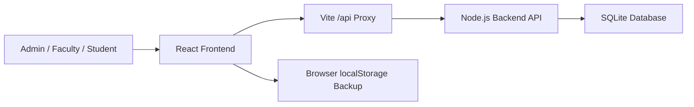

# Architecture

CampusOps AI is a local full-stack prototype for college operations.

## Frontend

- Vite + React + TypeScript
- Role-aware UI for Admin, Faculty, and Student
- Backend-backed login cards with demo-safe offline fallback
- Role-aware Campus Home backed by institution, readiness, and personal operations metrics
- College Setup workspace for administrator-managed institution identity and operating context
- Lazy-loaded heavier modules so students do not download admin-only screens
- Backend-backed Action Center is lazy-loaded for admin/faculty daily triage
- Admin-only Upload Data workspace is lazy-loaded separately from reports and student workflows
- PDF.js positional text extraction converts text-based PDF tables into canonical student, staff, subject, or timetable rows before backend validation
- Backend-backed Knowledge Center is lazy-loaded and provides source-cited policy search
- Responsive dashboard layout for presentation and daily operations
- Browser backup mode for demo safety

## Backend

- Node.js built-in HTTP server
- Node `node:sqlite` database driver
- No paid API and no external database service required
- SQLite file stored at `backend/data/campusops.sqlite`
- Auth sessions use bearer tokens stored in SQLite and sent through the frontend API client

## Persisted In Backend

- Demo users and active sessions
- Classes, students, teachers, academic subjects, and timetable slots
- Attendance records
- Period-wise leave requests and approval status
- Departments master data
- Subjects master data
- Staff profiles
- Circulars and circular read receipts
- Circular intelligence searches visible notices, unread status, urgent items, and deadlines
- Knowledge documents and searchable policy chunks
- Validated PDF/CSV/XLSX admin imports for students, staff profiles, subjects, and timetable slots
- Action Center items generated from live attendance, leave, workload, circular, timetable, and master-data signals
- Administrative reports generated from SQLite-backed operational data
- Action Center open/review actions
- Import commit actions and rejected-row export actions
- Report export actions for CSV, PDF, and XLSX downloads
- Audit events
- Institution profile, current academic context, and configurable attendance shortage threshold

## Backend RBAC

- Admin/faculty report requests require a valid backend session.
- Admin/faculty Action Center requests require a valid backend session.
- Admin-only writes such as imports, staff reset, circular publish/reset, and master-data edits are checked on the backend.
- Faculty report and Action Center payloads are limited to assigned leave, personal workload, and their own attendance marking gaps.
- Students do not load the Imports, Reports, or Action Center modules and cannot access those endpoints with a student session.
- All roles can search policy knowledge with a valid session; only admins can add or reset knowledge documents.
- All roles can ask circular questions, but answers are limited to notices visible to their session role and actor.

## Local-First Fallbacks

The frontend mirrors important state into browser localStorage after backend loads and saves. If the local backend is offline during a presentation, demo login, Staff Register, Circulars, Master Data, and academic workflows can still show their last browser backup instead of failing blank.

Imports, policy knowledge, Action Center, and reports are intentionally backend-first because they validate, search, and aggregate multiple operational tables. The Import Center, Knowledge Center, Action Center, and Reports Center show clear SQLite sync status so admins can tell whether data is live.

## Production Upgrade Path

For a college adoption pilot:

1. Replace demo account cards with password or SSO authentication.
2. Add password reset, account provisioning, and session expiry policies.
3. Expand endpoint permission checks to every academic write workflow.
4. Replace SQLite with PostgreSQL if multi-user deployment is needed.
5. Add backups, logs, and deployment monitoring.

The current College Setup and readiness model gives a pilot team a visible path through those foundations, but it does not replace production identity, infrastructure, or data-governance work.

The current structure already separates UI, API, data persistence, and documentation, so this upgrade path is straightforward.
