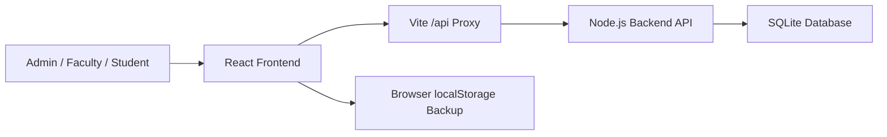

# Architecture

CampusOps AI is a local full-stack prototype for college operations.

## Frontend

- Vite + React + TypeScript
- Role-aware UI for Admin, Faculty, and Student
- Backend-backed login cards with demo-safe offline fallback
- Lazy-loaded heavier modules so students do not download admin-only screens
- Responsive dashboard layout for presentation and daily operations
- Browser backup mode for demo safety

## Backend

- Node.js built-in HTTP server
- Node `node:sqlite` database driver
- No paid API and no external database service required
- SQLite file stored at `backend/data/campusops.sqlite`
- Auth sessions use bearer tokens stored in SQLite and sent through the frontend API client

## Persisted In Backend

- Demo users and active sessions
- Classes, students, teachers, academic subjects, and timetable slots
- Attendance records
- Period-wise leave requests and approval status
- Departments master data
- Subjects master data
- Staff profiles
- Circulars and circular read receipts
- Administrative reports generated from SQLite-backed operational data
- Report export actions for CSV, PDF, and XLSX downloads
- Audit events

## Backend RBAC

- Admin/faculty report requests require a valid backend session.
- Admin-only writes such as staff reset, circular publish/reset, and master-data edits are checked on the backend.
- Faculty report payloads are limited to assigned leave, personal workload, and daily summary data.
- Students do not load the Reports module and cannot access report endpoints with a student session.

## Local-First Fallbacks

The frontend mirrors important state into browser localStorage after backend loads and saves. If the local backend is offline during a presentation, demo login, Staff Register, Circulars, Master Data, and academic workflows can still show their last browser backup instead of failing blank.

Reports are intentionally backend-first because they aggregate multiple operational tables. The Reports Center shows a clear SQLite sync status so the admin can tell whether report data is live.

## Production Upgrade Path

For a college adoption pilot:

1. Replace demo account cards with password or SSO authentication.
2. Add password reset, account provisioning, and session expiry policies.
3. Expand endpoint permission checks to every academic write workflow.
4. Replace SQLite with PostgreSQL if multi-user deployment is needed.
5. Add backups, logs, and deployment monitoring.

The current structure already separates UI, API, data persistence, and documentation, so this upgrade path is straightforward.
